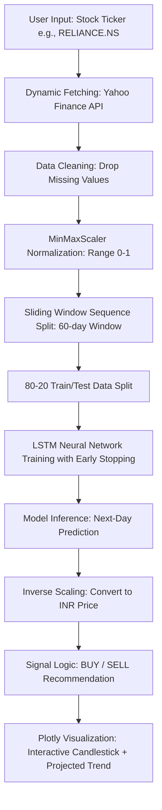

# 📈 AI-Driven Stock Price Forecasting Using LSTM (NSE Stocks)

[](https://www.python.org/)
[](https://www.tensorflow.org/)
[](https://plotly.com/)
[](https://finance.yahoo.com/)
[](https://opensource.org/licenses/MIT)

An interactive, deep learning-powered time series forecasting system designed to predict the next trading day's closing price of stocks listed on the **National Stock Exchange (NSE) of India**. The application implements a **Long Short-Term Memory (LSTM)** neural network trained on dynamic historical data, generates automatic **BUY / SELL** signals, and displays rich, interactive financial visualizations.

---

## 📖 Table of Contents
- [1. Project Overview & Objective](#1-project-overview--objective)
- [2. System Architecture](#2-system-architecture)
- [3. Deep Learning Model Design](#3-deep-learning-model-design)
- [4. Data Preprocessing Pipeline](#4-data-preprocessing-pipeline)
- [5. Interactive Prediction UI](#5-interactive-prediction-ui)
- [6. Evaluation Metrics & Performance](#6-evaluation-metrics--performance)
- [7. Installation & Getting Started](#7-installation--getting-started)
- [8. Responsible AI & Financial Disclaimer](#8-responsible-ai--financial-disclaimer)
- [9. Future Scope & Roadmap](#9-future-scope--roadmap)

---

## 🎯 1. Project Overview & Objective

Stock markets are inherently non-linear, highly volatile, and complex. Traditional statistical models often fall short in capturing long-term temporal dependencies in financial time-series data. 

This project aims to solve this problem by leveraging **Deep Learning**. Using an LSTM network, the system:
* **Learns sequential patterns** from historical price movements over the last 2 years.
* **Forecasts** the next trading day's closing price.
* **Formulates actionable trading signals** (BUY / SELL) based on predicted price trajectory relative to the last close.
* **Democratizes access** to deep-learning-based financial insights via an interactive, user-friendly notebook interface.

---

## ⚙️ 2. System Architecture

The workflow below illustrates the end-to-end processing pipeline, from user input to interactive prediction plots:



---

## 🧠 3. Deep Learning Model Design

### Network Topology
LSTMs are recurrent neural networks (RNNs) capable of learning order dependence in sequence prediction problems. The network structure is configured as follows:

1. **Input Layer**: Formatted to receive a matrix shape of `(batch_size, 60, 1)`, representing a 60-day sliding window of univariate closing prices.
2. **LSTM Layer**: 
   * **50 Memory Units (neurons)**.
   * Learns and retains temporal dependencies, mitigating the vanishing/exploding gradient problem common in vanilla RNNs.
3. **Dropout Layer (Regularization)**: 
   * **Rate: 0.2**.
   * Randomly deactivates 20% of neurons during training to prevent overfitting.
4. **Dense Output Layer**: 
   * **1 Neuron** with linear activation to output the continuous predicted scaled stock price.

### Optimization & Training Parameters
* **Loss Function**: Mean Squared Error (MSE), defined as:
  $$\text{MSE} = \frac{1}{n} \sum_{i=1}^{n} (y_i - \hat{y}_i)^2$$
* **Optimizer**: **Adam** (Adaptive Moment Estimation) for computationally efficient gradient descent.
* **Early Stopping**: Configured with a patience of `5 epochs`. It monitors the validation split, stops training if performance plateaus, and restores the weights of the best performing epoch to ensure maximum generalization.
* **Max Epochs**: 50 (typically terminates early due to Early Stopping).
* **Batch Size**: 32.

---

## 📊 4. Data Preprocessing Pipeline

To ensure quality inputs for neural network training, the following pipeline is executed dynamically:
1. **Dynamic Ingestion**: Fetches market data using the `yfinance` library. If a user inputs a ticker without the standard Indian exchange suffix (e.g., `TCS`), the system automatically appends `.NS`.
2. **Feature Extraction**: Extracts the `Close` price to create a univariate dataset.
3. **Scaling**: Normalizes raw rupee values to scale-invariant values between $0$ and $1$ using Scikit-learn's `MinMaxScaler`:
   $$x_{\text{scaled}} = \frac{x - x_{\text{min}}}{x_{\text{max}} - x_{\text{min}}}$$
4. **Supervised Representation**: Formulates the dataset such that:
   * **Input Vector ($X_t$)**: $[P_{t-60}, P_{t-59}, \dots, P_{t-1}]$ (Previous 60 trading days)
   * **Target Scalar ($y_t$)**: $[P_t]$ (Closing price of day 61)

---

## 🖥️ 5. Interactive Prediction UI

Built using **IPython Widgets (`ipywidgets`)**, the system embeds a native user interface inside the Jupyter notebook environment. 

### Interactive Cycle:
1. **Input Fields**: A text box allows users to type any valid NSE ticker (e.g., `HDFCBANK.NS`, `INFY.NS`, `TATASTEEL.NS`).
2. **Button Trigger**: A "Predict Next Day" green button initiates the execution callback.
3. **Automated Pipeline**: The cell dynamically downloads the latest 2-year history, builds and trains a fresh model customized to that stock's volatility profile, and performs inference.
4. **Output Panel**: Outputs detailed stats in Indian Rupees:
   * **Last Closing Price** (₹)
   * **Predicted Next-Day Close** (₹)
   * **Expected Change (%)** (direction and magnitude)
   * **Actionable Signal**: **BUY** (if predicted price > last close) or **SELL** (if predicted price ≤ last close).
5. **Interactive Visualization**: Generates a **Plotly Candlestick chart** of the last 6 months, overlaid with a dotted projection line extending into the next trading day representing the prediction.

---

## 📈 6. Evaluation Metrics & Performance

The notebook measures prediction accuracy on the out-of-sample test set (last 20% of the timeline) using three standard metric formulas:

1. **Mean Absolute Error (MAE)**:
   $$\text{MAE} = \frac{1}{n} \sum_{i=1}^{n} |y_i - \hat{y}_i|$$
2. **Root Mean Squared Error (RMSE)**:
   $$\text{RMSE} = \sqrt{\frac{1}{n} \sum_{i=1}^{n} (y_i - \hat{y}_i)^2}$$
3. **Mean Absolute Percentage Error (MAPE)**:
   $$\text{MAPE} = \frac{100\%}{n} \sum_{i=1}^{n} \left| \frac{y_i - \hat{y}_i}{y_i} \right|$$

These metrics are printed at the end of the notebook execution, along with a validation plot showing the **Actual Close vs. Predicted Close** over the test phase timeline.

---

## 🚀 7. Installation & Getting Started

### Prerequisites
* Python 3.8 or higher
* Jupyter Notebook or JupyterLab

### 1. Clone or Download the Workspace
Ensure the notebook file `Nse_AI_stock_price_analysis (1) (2).ipynb` is placed in your project directory.

### 2. Install Required Packages
Install the required libraries using pip:
```bash
pip install -q yfinance tensorflow plotly ipywidgets pandas numpy scikit-learn matplotlib
```

### 3. Enable Jupyter Widgets Extension (If using older Jupyter versions)
```bash
jupyter nbextension enable --py widgetsnbextension
```

### 4. Run the Jupyter Notebook
Start Jupyter Notebook and open the workspace file:
```bash
jupyter notebook "Nse_AI_stock_price_analysis (1) (2).ipynb"
```
Run all cells (`Cell -> Run All` or `Kernel -> Restart & Run All`) to start the interactive dashboard.

---

## ⚖️ 8. Responsible AI & Financial Disclaimer

> [!WARNING]
> **Educational & Analytical Purposes Only**
>
> 1. **No Financial Advice**: The predictions generated by this LSTM model do not constitute financial advice, buy/sell recommendations, or investment plans. Stock market investments are subject to market risks.
> 2. **Model Limitations**: The network relies exclusively on historical price structures (univariate data) and does not take into account trading volumes, order book dynamics, technical indicators (RSI, MACD), macroeconomic variables, corporate actions, or news sentiment.
> 3. **Non-Stationarity**: Stock market data is notoriously non-stationary. Past trends mapped by the neural network can break instantly due to sudden market announcements, quarterly results, or global macro shifts.
> 4. **Ethical Use**: Users should verify predictions with professional human broker research and perform proper risk assessment before investing capital.

---

## 🔮 9. Future Scope & Roadmap

To evolve this project into a production-grade algorithmic model, the following improvements are planned:
* **Multivariate Inputs**: Incorporate volume data and indicators such as RSI, MACD, and Bollinger Bands into the input sequence array.
* **Advanced Neural Architectures**: Transition to Bidirectional LSTMs (Bi-LSTM), Gated Recurrent Units (GRUs), or Transformer-based attention mechanisms.
* **Sentiment Analysis**: Scraping financial news headlines (from sources like Moneycontrol, Economic Times) and calculating daily sentiment polarity scores using VADER or FinBERT.
* **Multi-Step Forecasting**: Expanding prediction layers to forecast the next 5 to 10 trading days rather than just the immediate next day.
* **Production Web App**: Wrapping the pipeline in a **Streamlit** dashboard to host it on a public cloud server.
